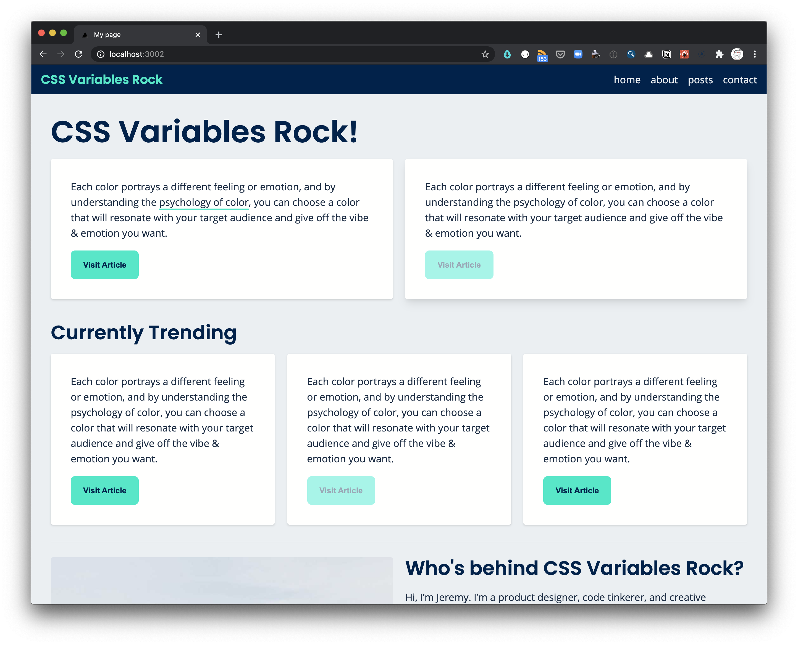
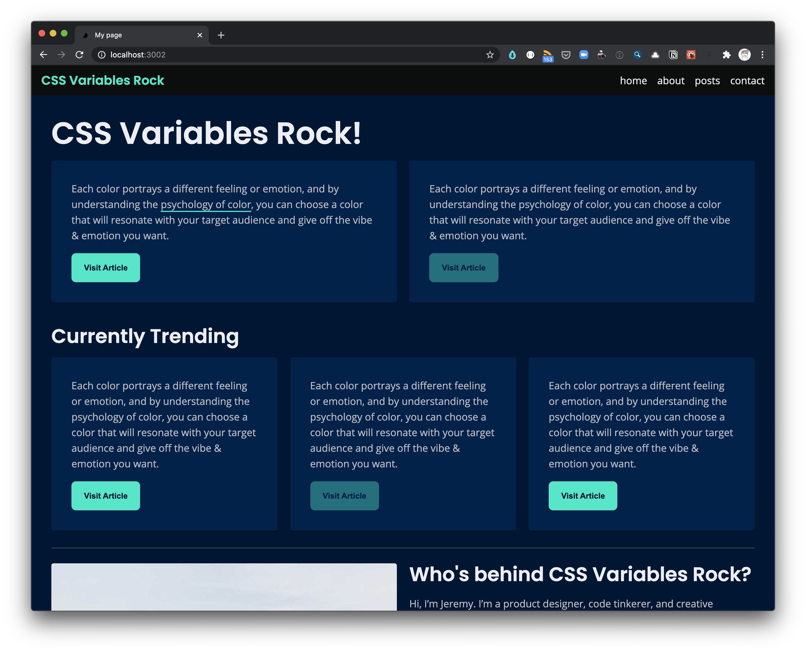

# Design Systems with CSS Variables (in Next.js)

This project illustrates how to build design systems with css variables. It's written in a Next.js application, but truthfully it could be applied to almost any project.



<br/>

## Quick start

To get set up, clone this repo and `cd` into the directory. In the terminal, run:

```
npm run dev
```

The project will be available at `http://localhost:3002/`

## Concepts

### Classless CSS

This approach relies heavily on _classless css_. Essentially, the css prefers to style elements directly (e.g. `h1`), rather than create new classes. Why? The idea is to provide great defaults for all of the elements, and to limit the need for classes or styled components.

### Global by default

This project defines most css variables in the `:root` of the `styles/globals.css` file. This file, is then used in the top level of the app, in a file called `_app.js`. This ensures that all css variables will be available to components throughout the app.

## Styled Components

There are in fact a few styled components in this project. They are primarily limited to:

### Wrapper Components

- A `Grid` component
- A `Flex` component
- A `Page Wrapper` component
- A `Card` component

These wrapper components exist to wrap and format `child` content. The intent is to allow a little bit of dynamic behavior. For example, the `Grid` component can recieve any number of columns through it's prop, `cols`. Likewise, the `Flex` component can recieve a `flexFlow` prop, to style the content as a column or as a row.

These are intentionally very simple API's, and under the hood they still leverage many of our css variables.

## Responsive

All of the content is mobile first and responsive. This is easily accomplished by the following css:

```
:root {
  /* layout composition */
  --grid-layout: block;
  --flex-layout: block;
}

@media only screen and (min-width: 720px) {
  /* convert block layouts to grids and flexs */
  :root {
    --grid-layout: grid;
    --flex-layout: flex;
  }
}
```

All this does is convert elements from `blocks` to `grids` and `flexes`.

## Themes

Because this project is built with css variables, theming is easily available. This project includes both a light and a dark theme, as seen below.




## Text Presets

To keep typography consistent throughout your site, I've also provided a `styles/type.css` file, which provides 7 `text-presets`. Each of these classes, mimics the `body` and `h1` through `h6` styles. Now, these classes can be applied to any text throughout your site, to give it the same treatment as your other text.

## Tools

The following websites are helpful for determining areas like:

- color
- type scale
- type pairings
- naming conventions

Websites:

- [Happy Hues](https://www.happyhues.co/)
- [Font Pair](https://www.fontpair.co/)
- [Type Scale](https://type-scale.com/)
- [Naming Typography CSS Variables](https://foxland.fi/naming-typography-css-variables/)
